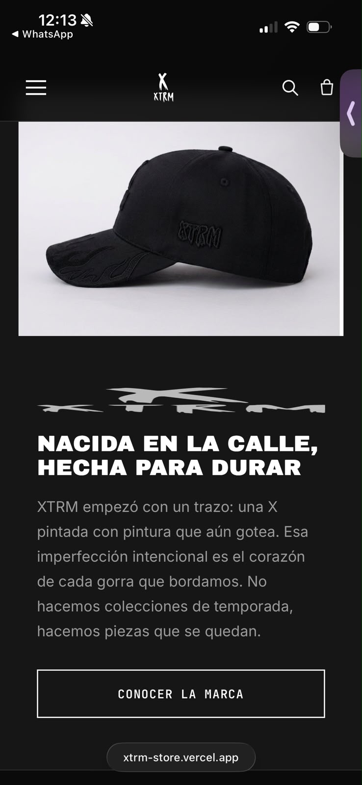
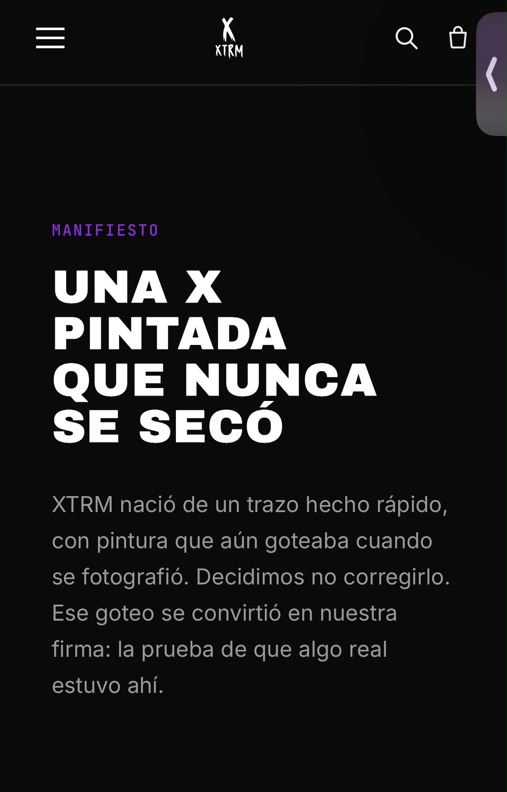
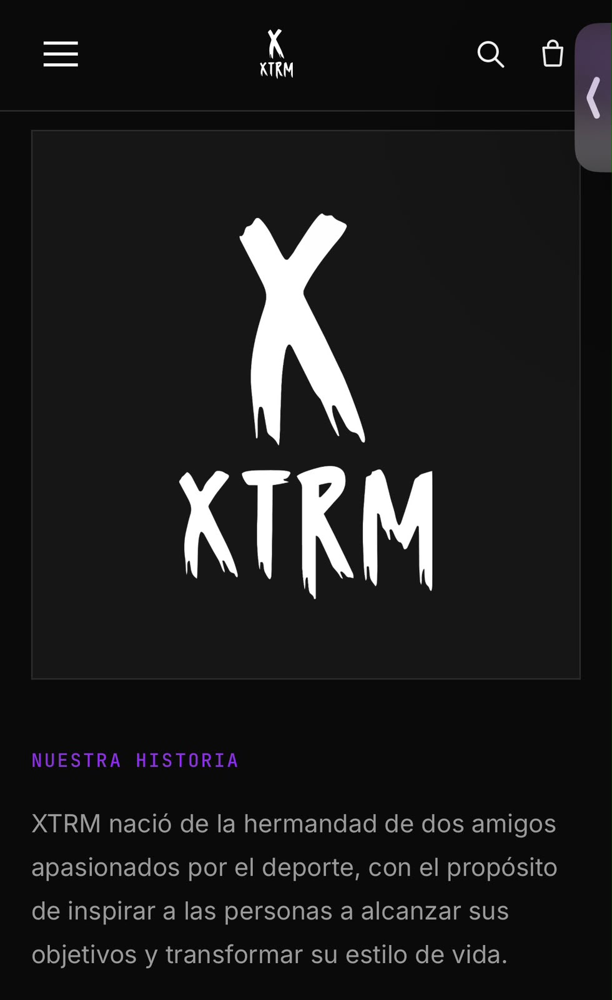
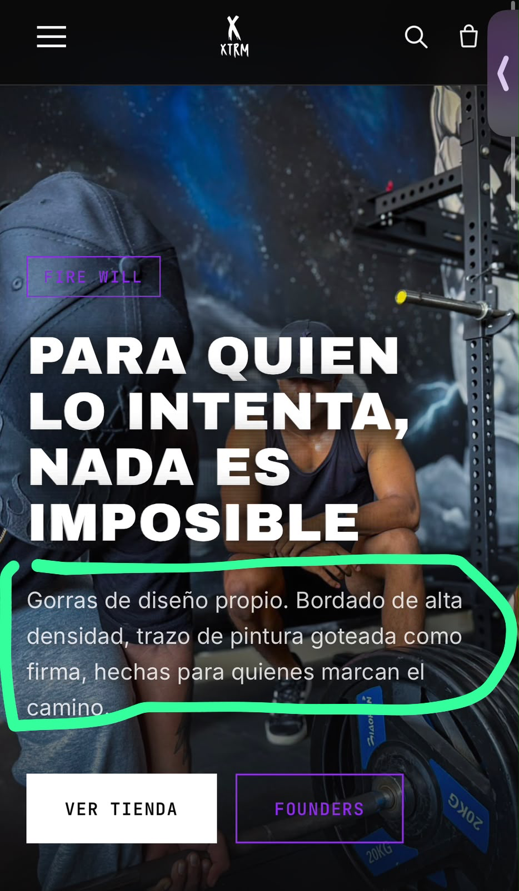
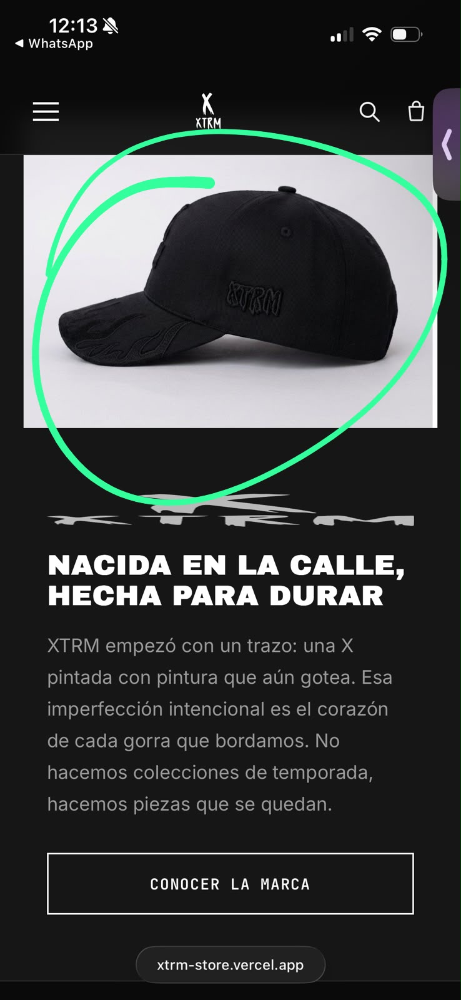

[6/08/26, 12:17:04 AM] Diego: Sale ese logo todo deformado y pues lo que dice ahí ese texto nada que ver, eliminarlo
[6/08/26, 12:17:14 AM] Diego: En el computador en la pestaña no sale el Favicon

[6/08/26, 12:17:50 AM] Diego: Ese manifiesto eliminarlo también

[6/08/26, 12:18:24 AM] Diego: En la historia me tramaba que estuviera el logo que tengo de perfil

[6/08/26, 12:19:30 AM] Diego: Y eliminar ese texto
[6/08/26, 12:21:58 AM] Diego: Bueno mano son como varias puntualidades que son mejor explicar en persona que estarlo molestando por chat
[6/08/26, 12:24:40 AM] Diego: Mano es que eso también modificó un poquito de cómo estaba antes
[6/08/26, 12:25:25 AM] Diego: Cuando uno abre la página abajo del todo aparece esta foto como toda de relleno toda repetida

[6/08/26, 12:26:19 AM] Diego: Yo creo que sería poner la foto de la portada ahí, o que no esté, solo el logo chimba tipo el que tengo de perfil